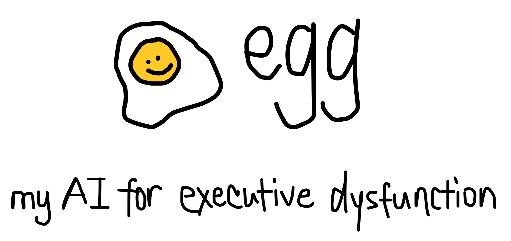
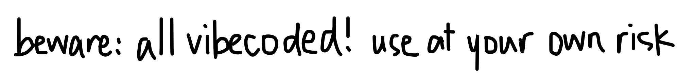

# egg

**egg** is an iMessage AI agent that "eggs me on" to become the best version of myself. It pushes me to stay on track, be more ambitious, and commit to the life I say I want.

I probably could have customized OpenClaw to do this, but in this age of coding agents, it was easier to simply build exactly what I wanted:

1. to supplement my own willpower in a highly personalized way, through background processes + proactive nudges
2. an iMessage interface for Claude Code
3. to use my Claude Max plan so I can save on token spend when I feed Opus 4.6 a computer's worth of personal data

## DISCLAIMER

**This is an ongoing personal experiment. Use at your own risk.**

This software reads your iMessage database, spawns AI subprocesses, and sends messages from your Mac. It is provided as-is with absolutely no warranty. I am not responsible for any messages sent, data read, conversations had, life decisions made, or anything else that happens if you install this on your computer. If Egg tells you to quit your job and you do it, that's on you.

Seriously: this is my personal AI agent that I built for myself. You're welcome to read the code, fork it, learn from it, or run it — but I make no guarantees and accept no liability.

---

## Quickstart

coming soon... not yet ready for public consumption

## How it works

Two repos, two machines, one brain.

```
┌──────────────────────┐       git push/pull        ┌──────────────────────┐
│    Personal Laptop   │◄──────────────────────────►│       Mac Mini       │
│                      │                            │                      │
│  egg intake imessage │     ┌────────────────┐     │  egg serve           │
│  egg intake daily    │────►│  egg-memory    │◄────│  egg nudge (cron)    │
│                      │     │  (GitHub)      │     │                      │
│  chat.db (personal)  │     │  SOUL.md       │     │  chat.db (Egg's)     │
│                      │     │  MEMORY.md     │     │  BlueBubbles         │
│                      │     │  people/*.md   │     │  2nd Apple ID        │
│                      │     │  goals.yaml    │     │                      │
│                      │     │  daily/        │     │                      │
│                      │     └────────────────┘     │                      │
└──────────────────────┘                            └──────────────────────┘
```

### The two repos

- **egg** (this repo, public) — the code: shell, brain wrapper, intake commands
- **egg-memory** (private) — the data: personality, dossiers, goals, daily context

The brain is just `claude -p` running inside the egg-memory directory. No Anthropic SDK, no tool registry. Claude Code already has file reading, editing, web search, etc. built in.

### The two machines

Egg is designed to run across two Macs that share the same `egg-memory` repo via git.

**Mac Mini** (always-on server):

- Runs `egg serve` continuously — polls iMessage for texts sent to Egg's Apple ID and replies via the brain
- Delivers proactive nudges (cron runs `egg nudge` periodically)
- Routes requests to Claude Code when asked

**Personal laptop** (on-demand):

- Runs `egg intake imessage` to process your full iMessage history, build dossiers on people and yourself, and push updates to egg-memory
- Can also run `egg intake daily` to generate daily context digests

Both machines have:

- `egg-memory` cloned to the same path
- Claude Code CLI installed and authenticated
- A cron job that `git pull`s egg-memory regularly to stay in sync

The `.egg-state.json` file (poll state, conversation history) is gitignored — each machine has its own local state. The shared data (dossiers, memory, goals, nudges) syncs through git.

## Prerequisites

- macOS (both machines)
- Node.js 20+ (`brew install node`)
- [Claude Code CLI](https://docs.anthropic.com/en/docs/claude-code) installed and authenticated (`claude` on your PATH)
- A second Apple ID signed into Messages.app on the Mac Mini (Egg's identity)
- [BlueBubbles Server](https://bluebubbles.app/) on the Mac Mini (optional — enables typing indicators and read receipts)

## Setup

### 1. Set up egg-memory (both machines)

Create a private GitHub repo for your data:

```bash
mkdir ~/egg-memory && cd ~/egg-memory
git init
mkdir -p people projects daily nudges/sent
```

Create the required files:

- `CLAUDE.md` — brain instructions (tells Claude how to read your memory files)
- `SOUL.md` — Egg's personality and voice
- `MEMORY.md` — what Egg knows about you
- `goals.yaml` — your goals
- `.gitignore` — should contain `.env` and `.egg-state.json`

Create `~/egg-memory/.env`:

```bash
EGG_BRAIN=claude

# Only needed on Mac Mini (for egg serve)
EGG_APPLE_ID=egg@example.com
EGG_USER_PHONE=+15551234567
BLUEBUBBLES_URL=http://localhost:1234
BLUEBUBBLES_PASSWORD=your-password
```

Push to GitHub and clone on both machines.

### 2. Install egg (both machines)

Clone this repo and link it globally:

```bash
git clone https://github.com/YOUR_USER/egg.git ~/egg
cd ~/egg
npm install
npm run build
npm link
```

This makes the `egg` command available globally on that machine.

### 3. macOS permissions (both machines)

Grant Terminal (or whatever runs `egg`) permission to control Messages.app:

**System Settings → Privacy & Security → Automation → Terminal → Messages**

Grant Full Disk Access so egg can read chat.db:

**System Settings → Privacy & Security → Full Disk Access → Terminal**

### 4. Mac Mini setup

Sign into Messages.app with a second Apple ID (Egg's identity):

**Messages → Settings → iMessage → Enable the second account**

Start the serve loop:

```bash
cd ~/egg-memory
egg serve
```

Set up proactive nudges (cron):

```bash
crontab -e
```

```
0 */3 * * * cd ~/egg-memory && egg nudge
*/5 * * * * cd ~/egg-memory && git pull --rebase --quiet
```

### 5. Laptop setup

Run intake to build initial dossiers from your iMessage history:

```bash
cd ~/egg-memory
egg intake imessage
```

Set up sync (cron):

```bash
crontab -e
```

```
*/5 * * * * cd ~/egg-memory && git pull --rebase --quiet
```

### 6. Oura ring (optional)

Egg can detect when you wake up and send a personalized good morning message based on your sleep score.

**Register an OAuth2 app** in the [Oura Developer Portal](https://cloud.ouraring.com/personal-access-tokens) under "OAuth2 Applications". Set the redirect URI to `http://localhost:<any-port>/callback`. Note your client ID and client secret.

**Add credentials** to your environment (in `~/egg-memory/.env`) or to `~/.egg/config.json`:

```bash
# Option A: .env
OURA_CLIENT_ID=your-client-id
OURA_CLIENT_SECRET=your-client-secret
```

```json
// Option B: ~/.egg/config.json
{
  "oura": {
    "clientId": "your-client-id",
    "clientSecret": "your-client-secret"
  }
}
```

**Authorize** (run once on the Mac Mini):

```bash
cd ~/egg-memory
egg oura:auth
```

This opens a browser, you approve access, and tokens are saved to `~/.egg/oura_tokens.json`. Egg will refresh them automatically as needed.

## Commands

All commands run from inside your `egg-memory` directory.

```bash
# Mac Mini — always running
egg serve              # poll iMessage, reply as Egg
egg serve --bb-only    # BlueBubbles only (no AppleScript fallback)

# Either machine
egg nudge              # ask brain if a nudge is warranted
egg nudge --dry-run    # preview without writing nudge file
egg intake daily       # generate daily context digest
egg oura:auth          # authorize Oura ring via OAuth2 (one-time setup)
egg status             # show config and pending nudges

# Laptop — on-demand
egg intake imessage    # process iMessage history, update dossiers, commit + push
```

## Development

```bash
# Clone egg repo
git clone https://github.com/YOUR_USER/egg.git
cd egg
npm install
npm run build

# Run locally without installing
npm run dev -- serve
npm run dev -- intake imessage

# Type check
npx tsc --noEmit
```

## License

MIT
